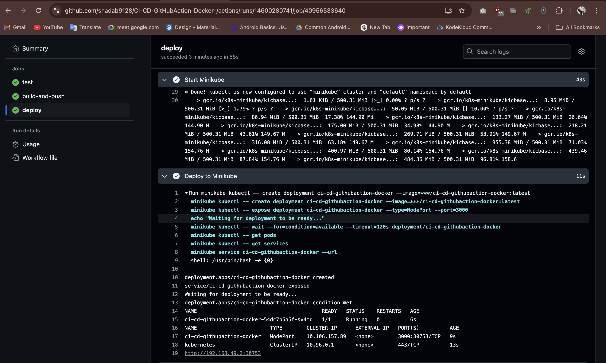

# CI/CD Pipeline with GitHub Actions & Docker
A complete CI/CD pipeline demonstrating GitHub Actions workflow with Docker containerization and local deployment using Minikube.

## Features

- Automated testing with Jest
- Docker containerization
- CI/CD pipeline with GitHub Actions
- Local Kubernetes deployment with Minikube
- Health check endpoint

## Prerequisites

- [Node.js](https://nodejs.org/) (v18 or higher)
- [Docker](https://www.docker.com/) (v20.10 or higher)
- [Minikube](https://minikube.sigs.k8s.io/docs/start/) (v1.25 or higher)
- [kubectl](https://kubernetes.io/docs/tasks/tools/)
- [GitHub Account](https://github.com/)
- [Docker Hub Account](https://hub.docker.com/)


## Setup Instructions

### 1. Clone the Repository

```bash
git clone https://github.com/YOUR_USERNAME/ci-cd-githubaction-docker.git
cd ci-cd-githubaction-docker
```
### 2. Install Dependencies
```bash
npm install
```
### 3. Run Tests Locally
```bash
npm test
```
### 4. Run the Application Locally
```bash
npm start
```
- Visit http://localhost:3000 in your browser.
### 5. Build and Run with Docker
```bash
docker build -t ci-cd-githubaction-docker .
docker run -p 3000:3000 ci-cd-githubaction-docker
```
### 6. Deploy to Minikube
- Start Minikube
```bash
minikube start
```
- Load Docker image into Minikube
```bash
minikube image load ci-cd-githubaction-docker
```
- Create deployment
```bash
kubectl create deployment ci-cd-githubaction-docker --image=ci-cd-githubaction-docker
```
- Expose service
```bash
kubectl expose deployment ci-cd-githubaction-docker --type=NodePort --port=3000
```
- Get service URL
```bash
minikube service ci-cd-githubaction-docker --url
```

## Screenshots

### 1.


### 2.


### 3.


### 4.


### 5.


### 6.


### 7.


### 8.


### 9.


## Second Project is mention in Project-2 Branch in this Repository
- Please check the branch

